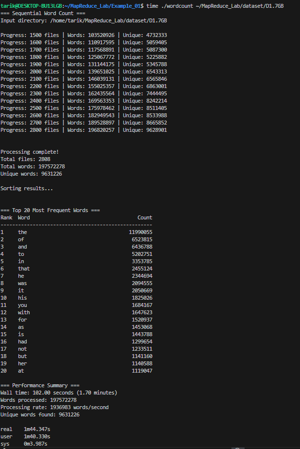
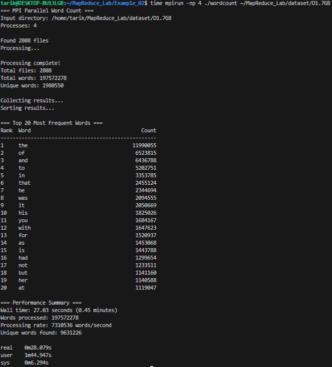
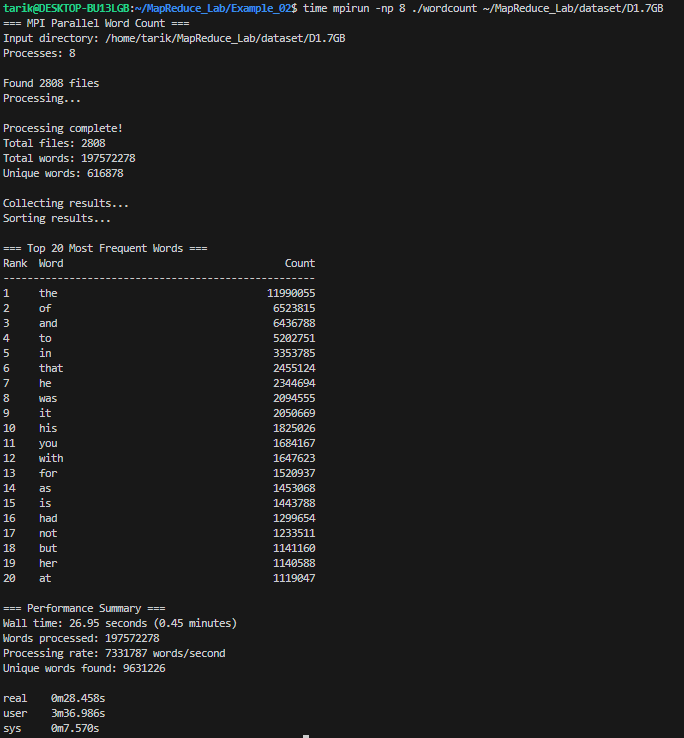
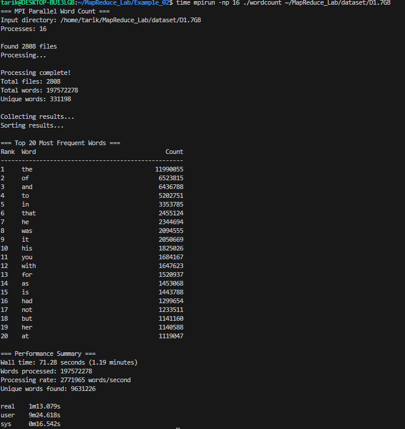

# ParallelComputing

# MapReduce Lab Assignment - Week 13

Student: Tarik Hadrović  
Course: IT 2004 - Parallel Programming  
Date: January 2026

## Assignment Overview

This assignment implements and compares sequential and parallel MapReduce word counting algorithms using MPI. The dataset contains 2808 text files with approximately 197.5 million words from various literature sources.

---

## 1. Screenshots

Sequential Execution:

Parallel Execution - 2 Processes:

Parallel Execution - 4 Processes:

Parallel Execution - 8 Processes:

Parallel Execution - 16 Processes:

---

## 2. Parallel vs Sequential Implementation

The sequential implementation processes files one by one in a single thread using a hash table to
store word counts. It's straightforward with no communication overhead.

The parallel implementation splits files across multiple MPI processes. Each process maintains its
own hash table and processes assigned files independently. The main difference is the use of MPI 
operations. MPI_Bcast sends the file list to all processes, then each determines which files to 
process based on its rank. After processing, MPI_Gather and MPI_Gatherv collect results from all 
workers. The master process then merges everything and outputs the final counts.

This parallelizes the Map phase where workers independently count words, while Shuffle and Reduce 
happen during result aggregation.

---

## 3. Performance Comparison

Sequential took 104.35 seconds with a rate of 1.9 million words per second. With 2 processes it 
dropped to 44.75 seconds (2.33x speedup, 4.5 million words/sec). Four processes achieved the best 
result at 28.08 seconds (3.71x speedup, 7.3 million words/sec).

However, 8 processes barely improved at 28.46 seconds (3.67x speedup), showing we hit a bottleneck. 
With 16 processes performance degraded to 73.08 seconds (1.43x speedup), actually slower than 2 
processes.

The sweet spot is 4 processes. Beyond that, overhead from managing more processes and MPI 
communication outweighs benefits. The system likely has 4-8 cores, so 16 processes causes context 
switching and resource contention. Also, parts of the algorithm like shuffle and reduce can't fully 
parallelize, limiting speedup as per Amdahl's Law.

---

## 4. Sequential vs Parallel Results Comparison

Both versions produce identical results. Total words counted: 197,572,278 with 9,631,226 unique 
words. The top 20 words match exactly across all runs.

For example, "the" appears 11,990,055 times, "of" appears 6,523,815 times, and "and" appears 6,436,
788 times in all configurations. This confirms the parallel version correctly distributes work and 
properly aggregates results without errors.

---

## 5. Hash Table vs Sorting for Shuffle Phase

The implementation uses a hash table for shuffling. Each word hashes to a bucket with collisions 
handled by linked lists. This gives O(1) average insertion and lookup, allowing immediate counting 
as words are read. Grouping happens automatically since identical words hash to the same bucket.

An alternative would be collecting all word occurrences as pairs, then sorting by key. Sorting 
takes O(n log n) but provides better cache locality and handles very large datasets with external 
sorting.

For this in-memory word counting, hash tables are faster. We only store unique words with counts 
instead of millions of individual pairs. With 197 million total words but only 9.6 million unique, 
this saves significant memory. Hash table operations are O(1) versus O(n log n) for sorting.

Sorting would help if output needs to be fully sorted, data doesn't fit in memory, or in 
distributed systems with network shuffling. But for our case, hash tables are more efficient.

---

## Conclusion

The parallel implementation achieves good speedup with 4 processes (3.71x). Beyond that, overhead 
dominates and performance drops. Hash tables prove more efficient than sorting for in-memory word 
counting. Results are consistent across all configurations, confirming correct implementation.