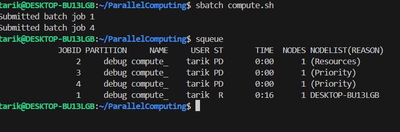
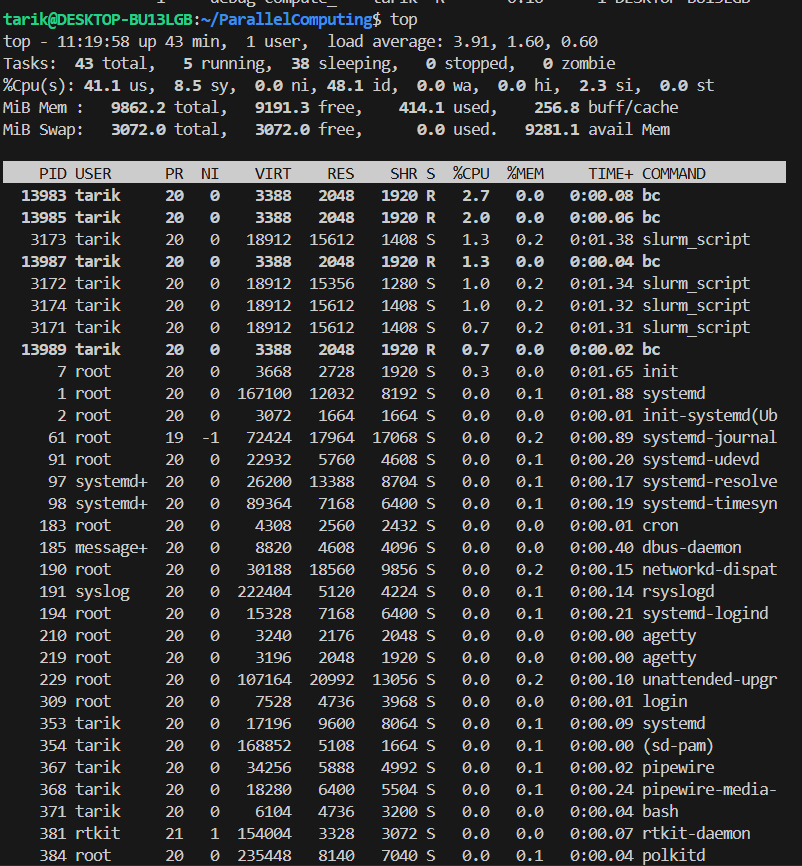
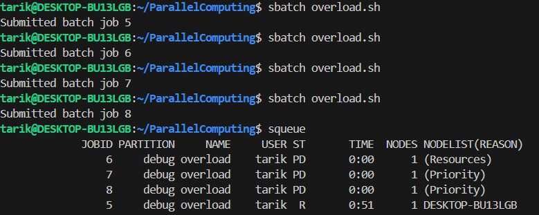
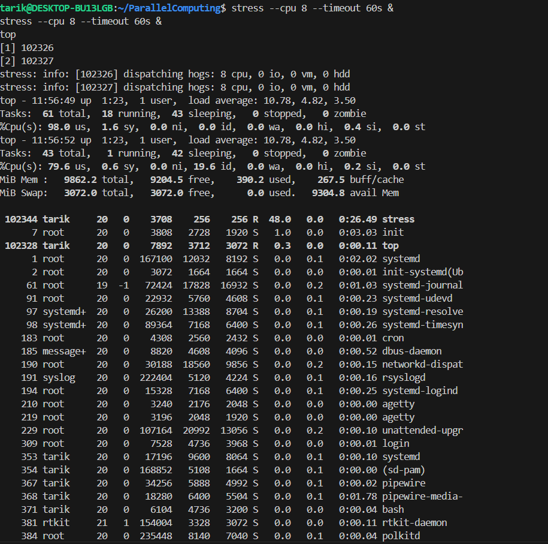
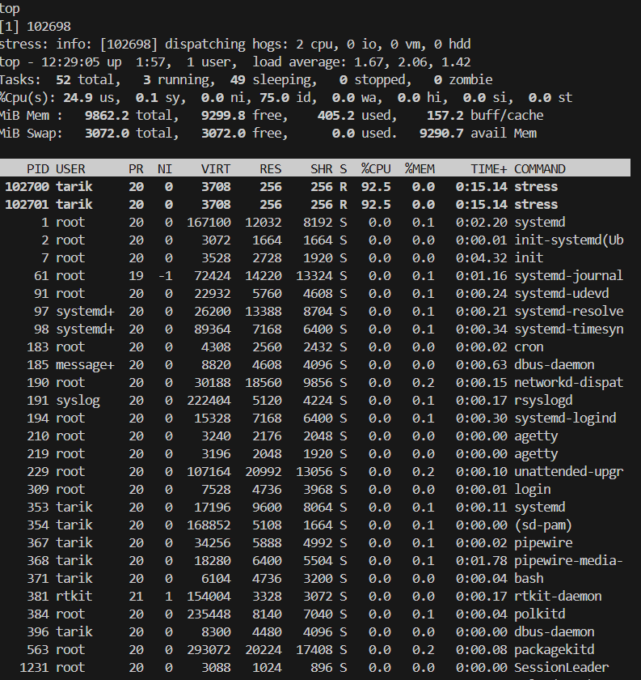
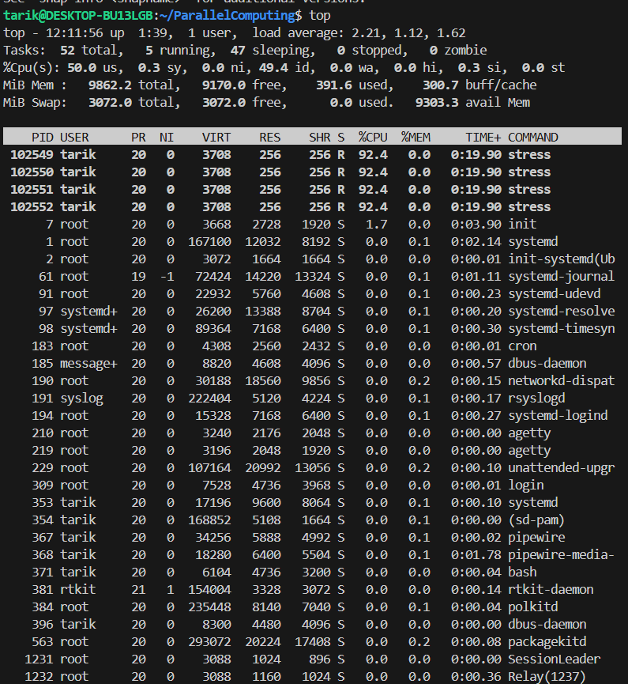

# Week 11 - Batch schedulers

## System Info
- CPU: 8 cores
- Hostname: DESKTOP-BU13LGB

sudo slurmd -C


## Task 1 - compute.sh

Modified script to use 8 CPUs and ran it 4 times with sbatch.





Jobs ran one by one. Each took 5 minutes and got killed by time limit.

---

## Task 2 - overload.sh

### With Slurm




Jobs ran sequentially, each got 8 CPUs.

### Without Slurm

Ran two stress commands at same time:
```bash
stress --cpu 8 --timeout 60s &
stress --cpu 8 --timeout 60s &
```



16 processes competing for 8 cores. Each only got ~46% CPU instead of 100%. This shows oversubscription is bad - causes context switching overhead.

**Difference:** With Slurm jobs wait in queue and get exclusive resources. Without Slurm they all run together and fight for CPU causing slowdown.


## Task 3 - salloc tests

salloc -N 1 -n 1 -t 0:05:00


Requested 1 task but ran stress with 2 and 4 threads.





Slurm didn't block the extra threads because it uses proctrack/linuxproc which doesn't enforce hard limits. On real clusters they use cgroups for strict enforcement.


## Conclusion

Batch schedulers prevent chaos when multiple users share resources. Without Slurm everyone fights for CPU and performance drops. With Slurm jobs queue properly and get dedicated resources.